<h1 align="center">基于SpringBoot框架的师生论坛系统【带论文】</h1>

- <b>完整代码获取地址：从戎源码网 ([https://armycodes.com/](https://armycodes.com/))</b>
- <b>技术探讨、资料分享，请加QQ群：692619798</b>
- <b>作者微信：19941326836  QQ：3645296857</b>
- <b>承接计算机毕业设计、Java毕业设计、Python毕业设计、深度学习、机器学习</b>
- <b>选题+开题报告+任务书+程序定制+安装调试+论文+答辩ppt 一条龙服务</b>
- <b>所有选题地址 ([https://github.com/Descartes007/allProject](https://github.com/Descartes007/allProject)) </b>

## 一、项目介绍

基于SpringBoot框架的师生论坛系统，系统角色为管理员、普通用户，主要功能如下
### 管理员：
- 基本操作：登录、修改密码、获取个人信息、修改个人信息
- 用户管理：筛选用户、查看用户详情、新增用户、修改用户信息、删除用户、启用/禁用账户、分配角色
- 板块管理：新增板块、获取板块列表、查看板块详情、修改板块信息、删除板块
- 版主管理：添加/移除版主、获取版主列表、为板块分配版主、调整所辖板块
- 帖子管理：筛选帖子、获取帖子列表、查看帖子详情、修改帖子、删除帖子
- 评论管理：获取评论列表、查看评论详情、删除评论
- 通知管理：获取通知列表、发布通知、查看通知、修改通知、删除通知
- 举报管理：获取举报列表、筛选举报、查看举报详情、处理举报、修改举报状态
- 资源分类管理：新增分类、获取分类列表、修改分类、删除分类
- 资源管理：筛选资源、查看资源详情、上传资源、修改资源、删除资源、文件下载/预览
- 系统统计：查看系统概览、用户/帖子/评论/资源等统计概览
- 文件管理：上传图片/附件、文件访问与下载
### 普通用户：
- 基本操作：注册、登录、修改密码、获取个人信息、修改个人信息
- 板块与浏览：浏览板块列表、查看板块详情、按板块筛选内容
- 帖子功能：发布帖子、编辑/删除自己的帖子、查看帖子详情、收藏/取消收藏帖子、查看收藏列表
- 评论与互动：发表评论、回复评论、删除自己的评论、点赞/取消点赞评论
- 资源中心：浏览资源列表、按分类筛选、查看资源详情、上传资源、下载资源
- 搜索：关键字搜索帖子/资源
- 举报：对帖子/评论发起举报
- 通知中心：接收/查看系统通知

## 二、项目技术

- 编程语言：Java
- 项目架构：B/S 架构
- 前端技术：Vue、Vue Router、Vuex、Axios、ElementUI、SCSS
- 后端技术：Spring Boot、Spring Security、JWT、MyBatis-Plus、MyBatis、Knife4j（Swagger）、MySQL

## 三、运行环境

- JDK版本：1.8及以上都可以
- 操作系统：Windows7/10、MacOS
- 开发工具：IDEA、Ecplise、MyEclipse都可以

## 四、数据库配置文件

- npm版本：6.14.13及以上都可以
- Redis版本：3.2.100及以上都可以
- 文件名：application.properties
- 编码类型：utf8

## 论文截图

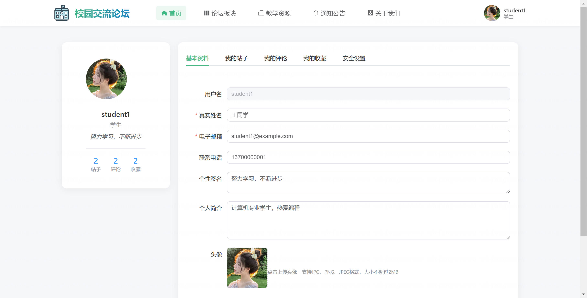

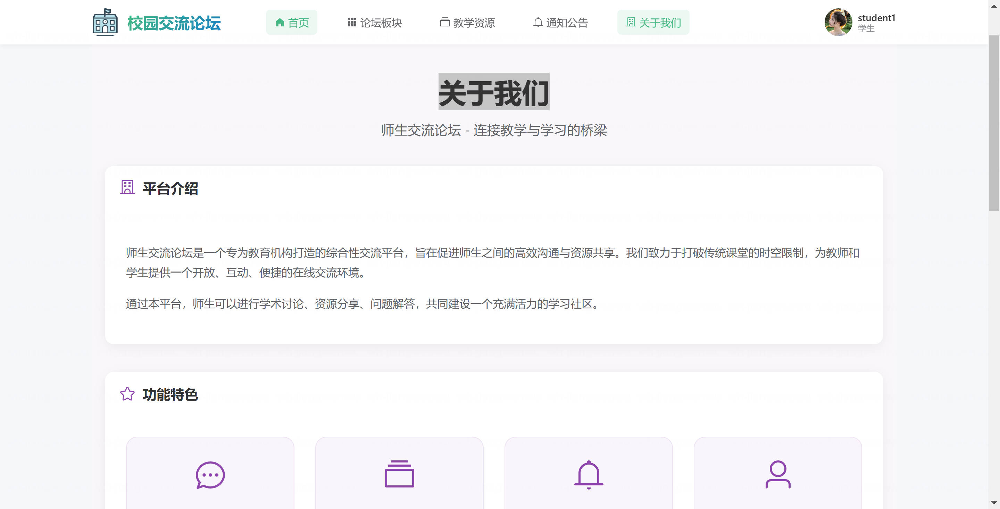

## 系统截图

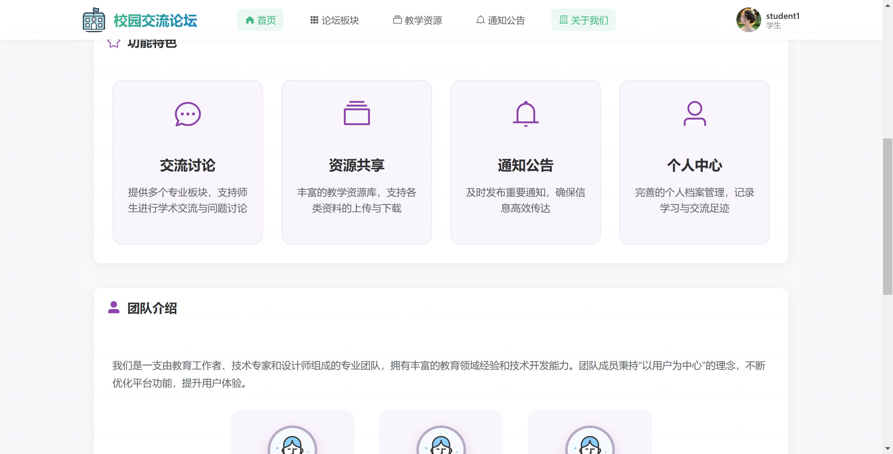

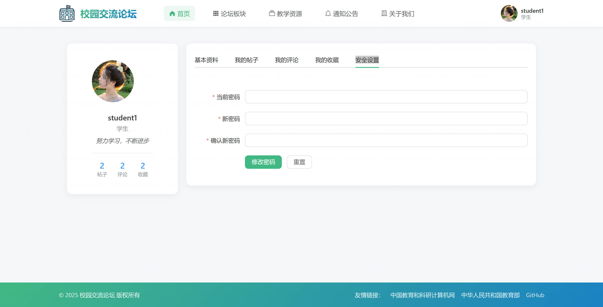

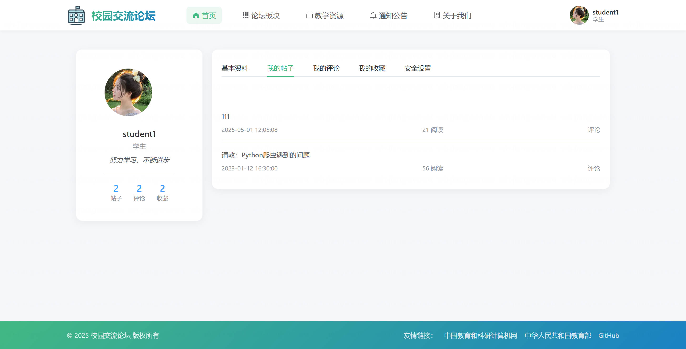

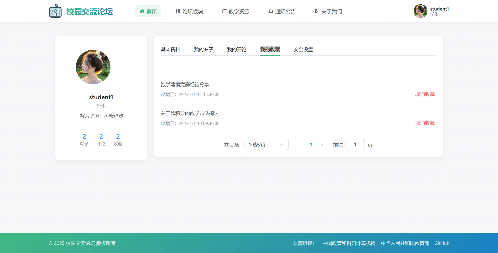

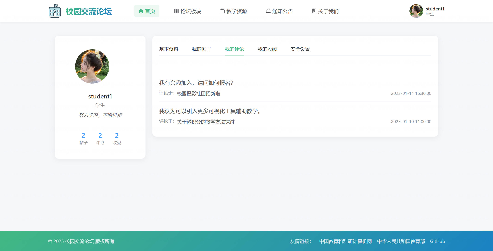

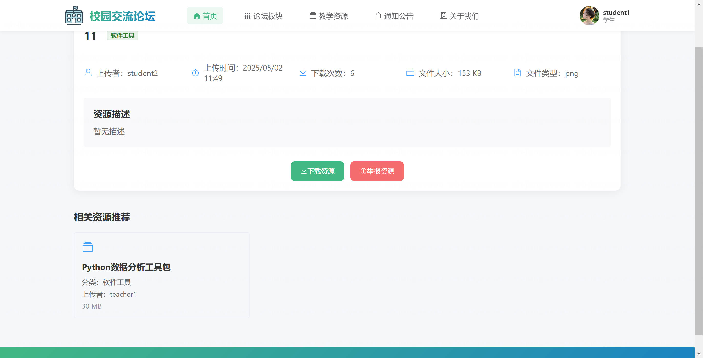

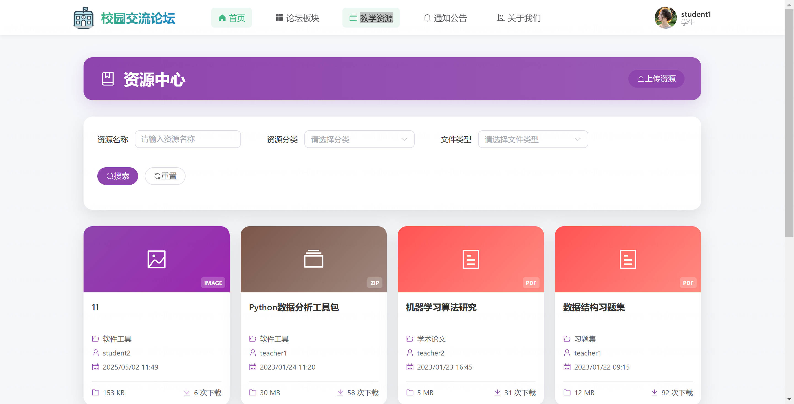

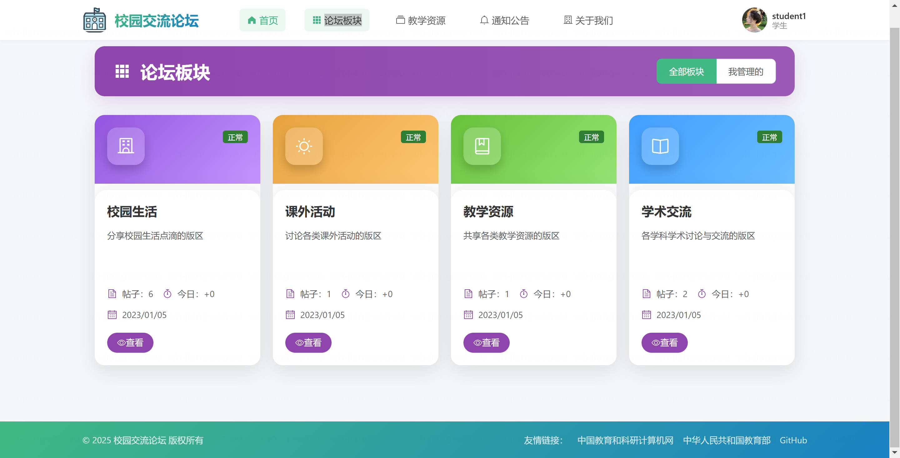

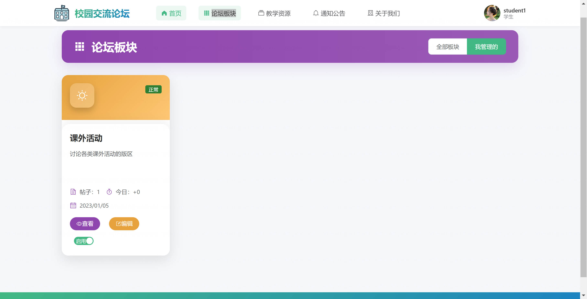

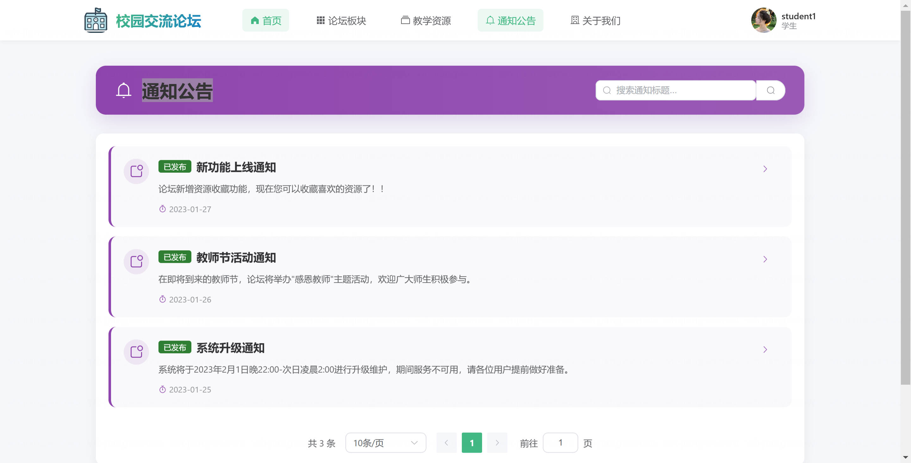
